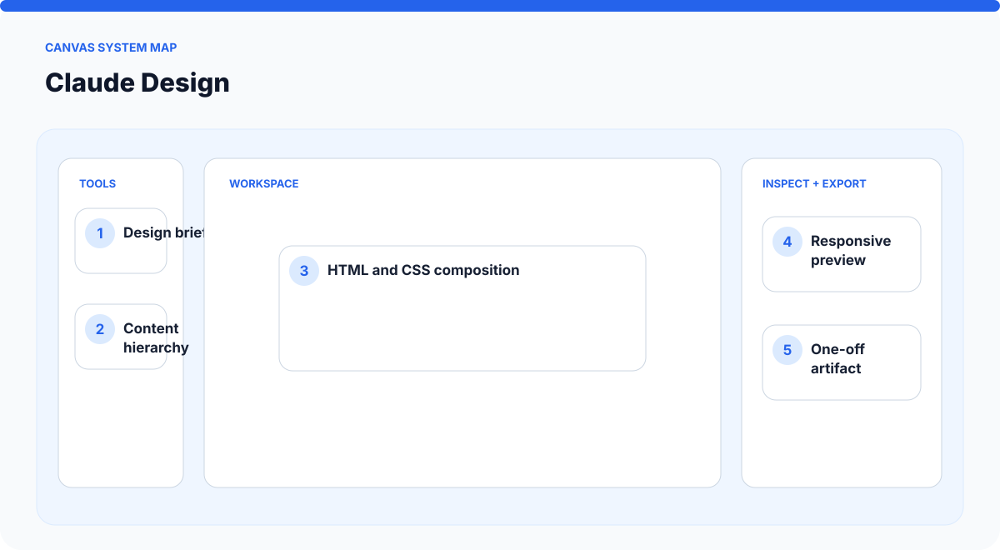
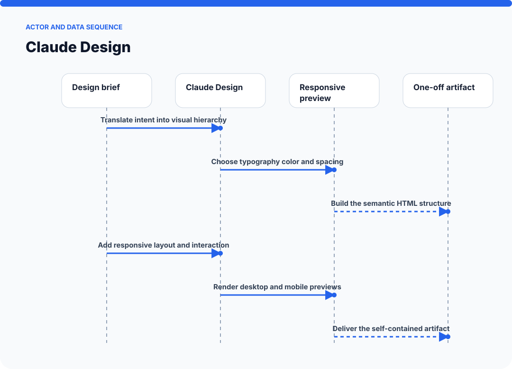
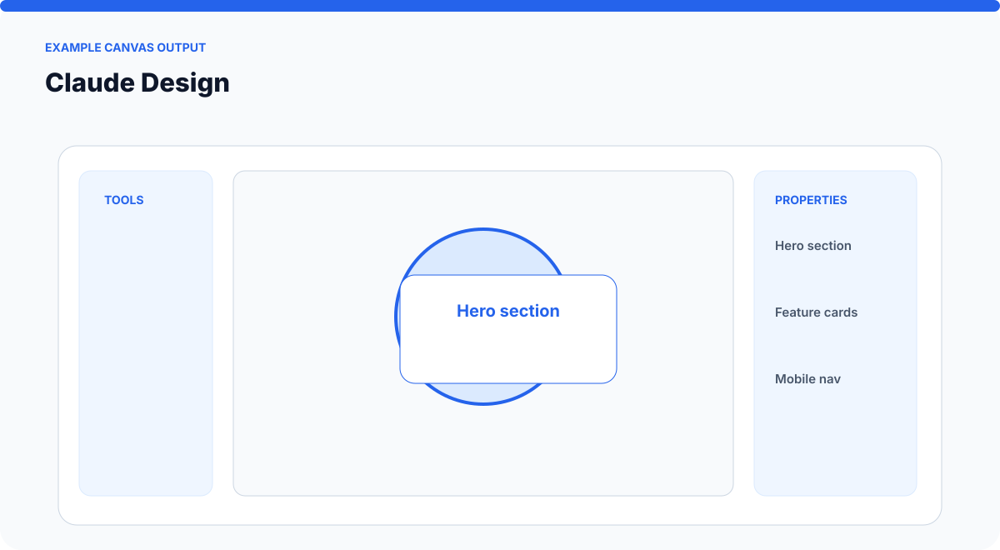
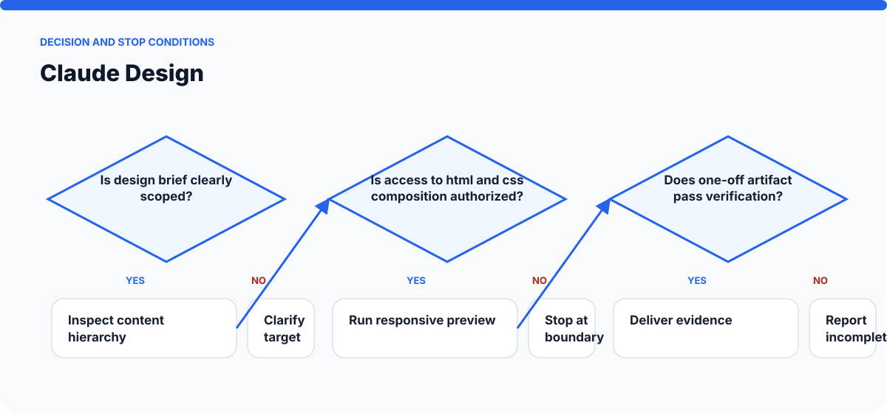

# How Claude Design Works

The visuals on this page are static SVGs, so they render directly on GitHub on phones and desktop browsers. Each one is generated from a model specific to this skill.

## System architecture

### Components

- **1. Design brief:** participates in translate intent into visual hierarchy.
- **2. Content hierarchy:** participates in choose typography color and spacing.
- **3. HTML and CSS composition:** participates in build the semantic html structure.
- **4. Responsive preview:** participates in add responsive layout and interaction.
- **5. One-off artifact:** participates in render desktop and mobile previews.

## Actor and data sequence

### 1. Translate intent into visual hierarchy

**Primary surface:** `Design brief`

Record the concrete input, the operation performed, and the evidence produced at this stage. Continue only when the output is sufficient for the next stage; otherwise preserve the blocker and stop.
### 2. Choose typography color and spacing

**Primary surface:** `Content hierarchy`

Record the concrete input, the operation performed, and the evidence produced at this stage. Continue only when the output is sufficient for the next stage; otherwise preserve the blocker and stop.
### 3. Build the semantic HTML structure

**Primary surface:** `HTML and CSS composition`

Record the concrete input, the operation performed, and the evidence produced at this stage. Continue only when the output is sufficient for the next stage; otherwise preserve the blocker and stop.
### 4. Add responsive layout and interaction

**Primary surface:** `Responsive preview`

Record the concrete input, the operation performed, and the evidence produced at this stage. Continue only when the output is sufficient for the next stage; otherwise preserve the blocker and stop.
### 5. Render desktop and mobile previews

**Primary surface:** `One-off artifact`

Record the concrete input, the operation performed, and the evidence produced at this stage. Continue only when the output is sufficient for the next stage; otherwise preserve the blocker and stop.
### 6. Deliver the self-contained artifact

**Primary surface:** `Design brief`

Record the concrete input, the operation performed, and the evidence produced at this stage. Continue only when the output is sufficient for the next stage; otherwise preserve the blocker and stop.

## Example output shape

The example is a visual contract: a real run may look different, but it should expose comparable state, provenance, and verification information. It is not presented as evidence of a live external action.

## Decision and stop conditions

The workflow stops when the target is ambiguous, the relevant surface is unavailable or unauthorized, or the final artifact cannot be checked. A logged-in session or successful tool call is not by itself proof that the requested outcome is complete.

## Verification checklist

- Confirm every component shown in the system map exists in the target environment.
- Trace the actor sequence using actual tool output or artifact state.
- Compare the result with the example-output information contract.
- Re-read or reopen the final artifact instead of trusting an attempt message.
- Report omitted stages, unsupported capabilities, and remaining human decisions.
